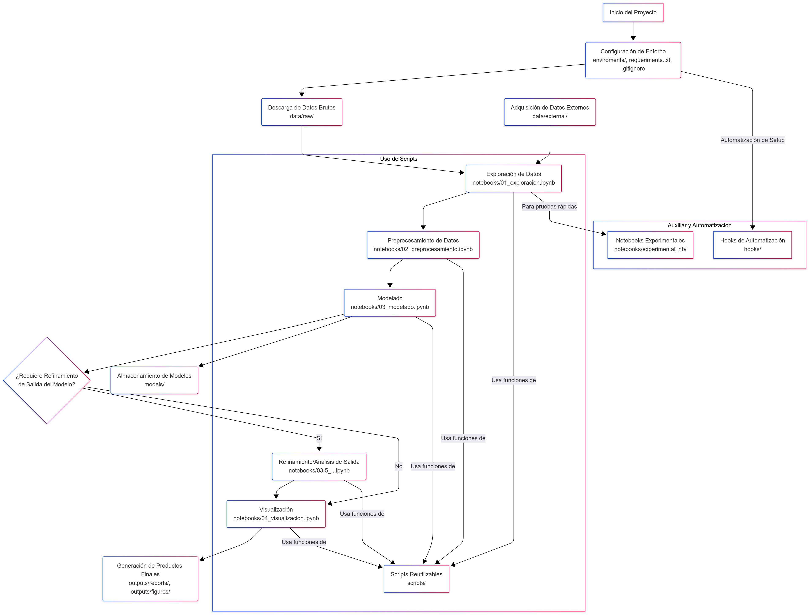

# 📊 Data_project

Este repositorio contiene el desarrollo de un proyecto de análisis de datos estructurado para garantizar claridad, organización y escalabilidad. La estructura del proyecto permite trabajar con múltiples fuentes de datos, modelos y scripts reutilizables.

---

## 🧱 Estructura del Proyecto
<pre> '''text
climate_seattle/
├── data/                       # Almacenamiento de datos
│ │
│ ├── raw/                      # Datos originales sin procesar
│ │   └── seattle-weather.csv
│ ├── processed/                # Datos limpios y listos para análisis
│ │   └── preprocess_data.csv
│ ├── external/                 # Datos de fuentes externas (API, descargas públicas)
│ └── README.md                 # Descripción de las fuentes y diccionarios de datos
│
├── hooks/                      # Instrucciones pre y post generacion del proyecto
│
├── notebooks/                  # Notebooks Jupyter organizados por etapas
│ │
│ ├── experimental_nb/          # Notebooks Jupyter de prueba o jnb sin terminar
│ │ │
│ │ └── 01_general_nb.ipynb
│ │
│ ├── 01_eda.ipynb
│ ├── 02_preprocess.ipynb
│ ├── 03_statistical_analysis.ipynb
│ ├── 04_time_analysis.ipynb
│ ├── 05_modeling.ipynb
│ └── 06_report_conclusions.ipynb
│
├── scripts/                    # Scripts Python reutilizables
│ │
│ ├── py_tolls/                 # Funciones propias para diversas tareas
│ ├── init.py
│ ├── eda_scripts.py            # Funciones para ananlisis de datos
│ ├── preprocess_scripts.py     # Funciones para limpieza y transformación
│ ├── modeling_scripts.py       # Funciones de modelado de datos o entrenamiento de modelos
│ ├── stat_analysis_scripts.py  # Funciones de analisis de datos.
│ ├── visualization_scripts.py  # Funciones para visualizacion de datos
│ └── paths.py                  # Paths disponibles
│
├── models/                     # Modelos entrenados y serializados (.pkl, .joblib)
│
├── outputs/                    # Resultados generados
│ │
│ ├── reports/                  # Reportes automáticos, informes
│figures/                  # Gráficos exportados,
│
├── enviroments/                # Configuraciones de entornos virtuales o Conda
│ └──  requeriments.txt         # Lista de dependencias para reproducibilidad
│
├── .gitignore                  # Exclusión de archivos no versionados
└── README.md                   # Documentación principal del proyecto
''' </pre>
## Flujo de Trabajo

